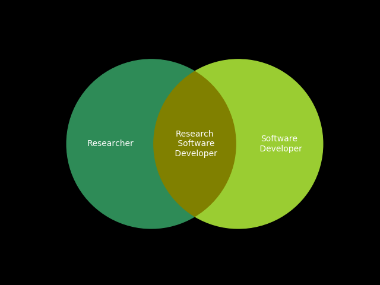

Me
==

James Hetherington
------------------

* PhD, Theoretical Physics
    * High-Energy Physics, Cavendish Laboratory
* Post-doc, systems biology, UCL CoMPLEx
    * Glucose homeostasis
* The MathWorks
    * Senior Developer, Model Management Group
* Senior Scientific Innovator, AMEE UK Ltd
    * Environmental impact modeling
* Scientific Programmer, UCL CCS
    * Brain blood flow CFD
* Head of Research Software Development, UCL

The State of Research Software
================================

The SIRO Problem
----------------

~~Garbage in Garbage Out~~

Sensible In, Reasonable Out.

PhDWare
-------

* Don't look if anyone's done it before
* Code till it works
* Generate a figure
* Throw it away

Labware
-------

* Understood by one genius
* Implements great science, now
* FORTRAN in any language
* Code not engineered for readability
* Can't add new science

HPCWare
-------

* Get a 5% improvement in performance
* On a particular architecture
* Publish a scaling graph
* Selection against:
      * Readability
      * Maintainability
      * Adaptability

ConsultantWare
--------

* Little understanding of the science
* Overengineered
* Unmaintainable by the research group

Research Software Developers
============================

The Craftsperson And The Scholar
----------------------------

Research Software Engineers
----------------------------

Research Software Engineers
----------------------------

* Not independent researchers
    * No personal research agenda
* Facilitative, supportive, and collaborative
    * Part of the academic community
    * Deep engagement with research groups
    * Understand, study, and be part of group research activities
    * Can read and understand the papers
* Sustainable and long term
    * Institutional memory
    * Continuity, stability, maintainance

Why it works
------------

* People *want* to be RSEs
* We have been hiding as:
    * RAs who program too much
    * HPC or research group sysadmins
* We need a name, and some status
* The research system needs to
    * Measure and incentivise RSEs correctly
    * Integrate RSEs within HEIs
    * Support institutional innovation
    
The story of RSEs
-----------------

* April 2012: Idea and name at SSI Collaborations Workshop
* September 2012: UCL Group Founded
* 2014: Manchester group
* 2015: Sheffield, Southampton and Cambridge Groups
* Jan 2016: EPSRC awards first Research Software Engineering Fellowships
* September 2016: First RSE conference, 202 attendees, 14 countries

Experiences from UCL
====================

The UCL Research Software Group
-------------------------------

* Helped UCL win over 1.5M in research income
* Grown through grant funding from just me to a team of 10
* Working with researchers from archaeology to astrophysics

Readable, reliable, and reproducible
---------------------------------

We help make code:

* Last beyond the end of the grant that funded it
* Be usable by someone other than the PhD student who wrote it
* Have a standard of correctness better than "the graph looks about right"

Clean code makes performance possible
=====================================

Whodunnit code: low-template DNA
--------------------------------

Structural work on likeLTD
--------------------------------------------

* Broken down into functions
* Separate objective function from home-made optimiser
* Use standard optimiser libraries

Performance Improvements in likeLTD
-------------------------------------------

* 4 times from moving to C
* 8 times from parallelisation
* 10 times from change of optimisation algorithm
* 300 times total

Engineering helps legacy code live
==================================

Old State of the Code
-----------------

* DCProgs: Venerable Fortran
* Hasn't compiled since 2006
* Underpins Nature-published research

The response
---------

* Old code as a "test Oracle"
* Reimplemented in C++ and Python
* Use linear algebra and root finding libraries
* Not slower

Current work
------------

* ARCHER parallelisation
* MCMC inferential algorithm

Reliability unlocks science
===========================

HemeLB Setup Tool
-----------------

Robustness
----------

* Can handle all geometries instead of 19 in 20
* Means can model changing geometries
* Reliability unlocks new science

RSEs and Teaching
=====================================================

Software Carpentry
------------------

* Intensive "bootcamp"
* Automation
* Version control
* Unit testing
* Databases

> I found the command line intimidating at first, but after a while it felt
> like I was inside my computer.

-- A student at a UCL software carpentry event

## Program or be Programmed

* Everyone scientist is a software engineer and data scientist now
* "Data Scientist" - "Food Chef?"
* *Reproducible* data-driven research *is* programming.
    * Come for the labour savings, but stay for the audit trail

## But the syllabus is full.

* Ideally, *everyone* would know *everything*!
* This is clearly impossible
* So we need *division of labour*
* and enough training to work together

## RITS's training programme

* Software carpentry
* Data carpentry
* Introductory Python for Data Analysis
* Research Software Engineering with Python
* Research Computing with C++
* High Performance and High Throughput Computing

* See the [materials](https://www.ucl.ac.uk/isd/services/research-it/training)

## Digitally native learning tools

* Web-first but classroom- and kindle-ready
    * Single source, multiple formats
* Examples which *work*:
    * Generated lecture notes from code that is *executed* and *complete*
* Open and collaborative
    * CC-BY license on notes
    * Massive cross-institutional co-creation

## Active classrooms

* Practicals and concepts together
* Bring your own device
* Post-it-notes and etherpads

Good, huh?
==========

Lessons learned
---------------

Well, it hasn't always been pretty.

I'll try to indicate some tips and tricks learned while
creating a generalist science-as-a-service software group.

Some of these we got right. Some are things I wish I'd
known at the beginning.

Sell performance, deliver reproducibility
-----------------------------------------

](http://farm7.staticflickr.com/6144/6202830241_f16833fbaf_z.jpg)

Use appropriate technology
--------------------------

](http://africawindmill.org/wp-content/uploads/2013/03/DSC01549-Copy-2-.jpg)

Look beyond the usual
---------------------

](http://github-pages.ucl.ac.uk/rsd-talks/rsd/assets/oracc.jpg)

The Craftperson and the Scholar
-----------------------------

Organisational Judo
-------------------

Computational Science as a Service
----------------------------------

<iframe width="420" height="315" src="https://www.youtube.com/embed/p85xwZ_OLX0" frameborder="0" allowfullscreen></iframe>

Copyright
---------

The sourcecode of this talk is available under a CC-BY license:

* [https://github.com/UCL/rsd-talks/tree/master](https://github.com/UCL/rsd-talks/tree/master)

The images in this talk are not copied. They are embedded or "transcluded".

* [Transclusion](https://en.wikipedia.org/wiki/Transclusion)
* [Transclusion and copyright](http://www.create.ac.uk/blog/2014/11/28/eu-ruling-embedding-does-not-equal-copyright-infringement/)
