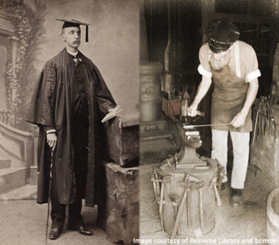
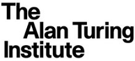
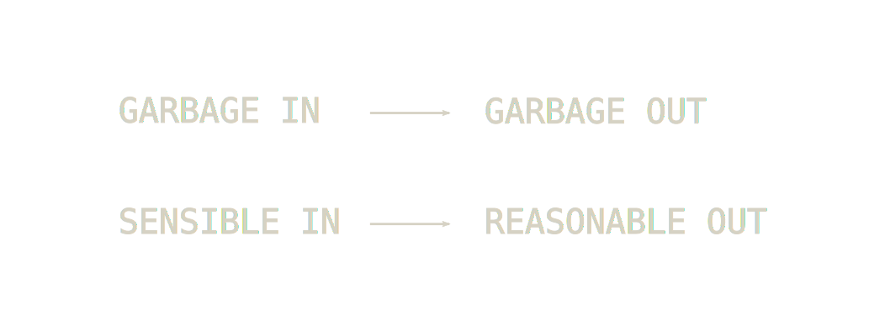
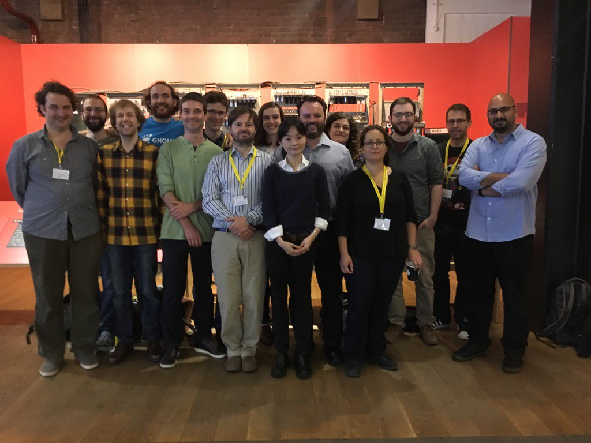
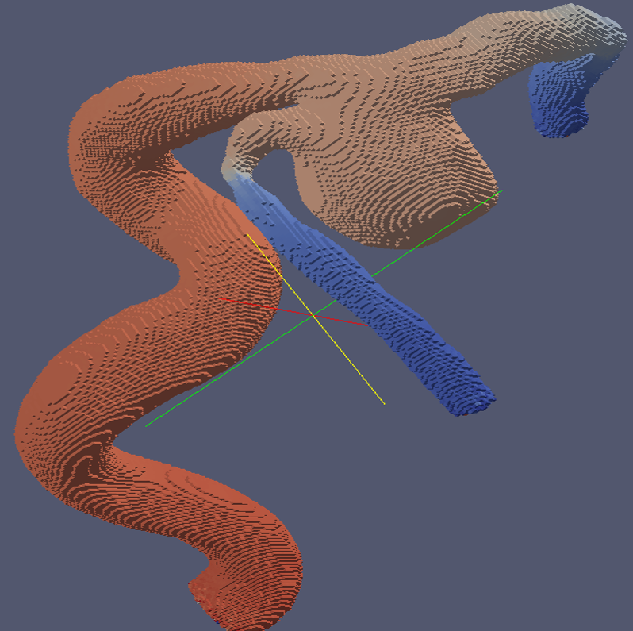
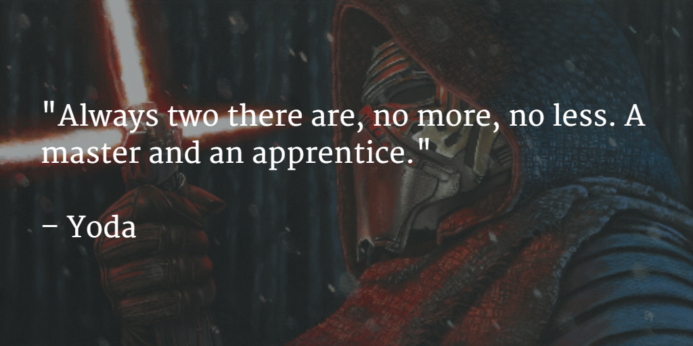

<section class="titlepage">

<h3>The Craftsperson</h3>
<h3>& The Scholar</h3>

by James Hetherington

</section>

The State of Research Software {.chapter-title}
================================

The SIRO Problem
----------------

PhDWare
-------

* Don't look if anyone's done it before
* Code till it works
* Generate a figure
* Throw it away

Labware
-------

* Understood by one genius
* Implements great science, now
* FORTRAN in any language
* Code not engineered for readability
* Can't add new science

HPCWare
-------

* Get a 5% improvement in performance
* On a particular architecture
* Publish a scaling graph
* Selection against:
      * Readability
      * Maintainability
      * Adaptability

ConsultantWare
--------

* Little understanding of the science
* Overengineered
* Unmaintainable by the research group

Research Software Engineers
============================

The Craftsperson And The Scholar {.poster}
----------------------------

Research Software Engineers {.poster}
----------------------------

Research Software Engineers
----------------------------

* Not independent researchers
    * No personal research agenda
* Facilitative, supportive, and collaborative
    * Part of the academic community
    * Deep engagement with research groups

Why it works
------------

* People *want* to be RSEs
* We have been hiding as:
    * RAs who program too much
    * HPC or research group sysadmins

The movement
------------

* We need a name and some status!

* The research system needs to
    * Measure and incentivise RSEs correctly
    * Integrate RSEs within HEIs
    * Support institutional innovation

Our story
---------

* April 2012: Idea and name at SSI Collaborations Workshop
* September 2012: UCL Group Founded
* 2014: Manchester group
* 2015: Southampton and Cambridge Groups
* Jan 2016: EPSRC awards first Research Software Engineering Fellowships
* 2016: Bristol, Sheffield Groups

Our story
---------

* September 2016: First RSE conference, 202 attendees, 14 countries
* 2017: Leicester, Imperial College groups.
* September 2017: Second conference, 224 attendees, 12 countries
* Formally incorporated as a charity
* Jan 2018: Second RSE fellows appointed

RSE Groups
==========

RSE Group
---------

* Shared home for RSEs in an institution
* Both academic and Support
* "Science as a Service"

Activities
----------

* Projects
* Consulting
* Training
* Infrastructure

Domain
------

* From HPC codes to simple scripts
* From theoretical physics to digital humanities

UCL Model
------------

* All roles "permanent"
* But funded from research grant income on a pooled basis

The UCL Research Software Group
-------------------------------

* Helped UCL researchers win over £2M
* Grown through grant funding
* From archaeology to astrophysics

Readable, reliable, and reproducible
---------------------------------

We help make code:

* Last beyond the end of the grant that funded it
* Be usable by someone other than the PhD student who wrote it
* Have a standard of correctness better than "the graph looks about right"

Why work with RSEs?
=====================================

Clean code makes performance possible
--------------------------------

<h5>LikeLTD</h5>

Structural work:

* Broken down into functions
* Separate objective function from home-made optimiser
* Use standard optimiser libraries

Clean code makes performance possible
-------------------------------------

<h5>LikeLTD</h5>

Performance improvements:

* 4 times from moving to C
* 8 times from parallelisation
* 10 times from change of optimisation algorithm
* 300 times total

			    
</section>

Engineering helps legacy code live
----------------------------------

<h5>DCProgs</h5>

Before:

* Venerable Fortran
* Hasn't compiled since 2006
* Underpins Nature published research

Engineering helps legacy code live
----------------------------------

<h5>DCProgs</h5>

Our solution:

* Old code as "test oracle"
* Reimplemented in C++ and Python
* Use linear algebra and root finding libraries
* Not slower

Since then:

* ARCHER parallelisation
* MCMC inference

Reliability unlocks science
---------------------------

<h5>HemeLB Setup Tool</h5>

* Voxelisation for Lattice Boltzman
* Crashed 1 time in 20
  * So tweak the origin!

Reliability unlocks science
---------------------------

<h5>HemeLB Setup Tool</h5>

* Replace with standard comp geometry library
* Can handle all geometries instead of 19 in 20</li>
* Means can model changing geometries</li>

RSEs and Teaching
=====================================================

Software Carpentry
------------------

* Intensive "bootcamp"
* Automation
* Version control
* Unit testing
* Databases

> I found the command line intimidating at first, but after a while it felt
> like I was inside my computer.

-- A student at a UCL software carpentry event

## RITS's training programme

* Software carpentry
* Data carpentry
* Introductory Python for Data Analysis
* Research Software Engineering with Python
* Research Computing with C++
* High Performance and High Throughput Computing

## Digitally native learning tools

* Web-first but classroom- and kindle-ready
    * Single source, multiple formats
* Examples which *work*:
    * Generated lecture notes from code that is *executed* and *complete*
* Open and collaborative
    * CC-BY license on notes
    * Massive cross-institutional co-creation

## Active classrooms

* Practicals and concepts together
* Bring your own device
* Post-it-notes and etherpads

## The syllabus is full.

* Ideally, *everyone* would know *everything*!
* This is clearly impossible
* So we need *division of labour*
* and enough training to work together

Good, huh?
==========

Lessons learned
---------------

Well, it hasn't always been pretty.

I'll try to indicate some tips and tricks learned while
creating a generalist science-as-a-service software group.

Some of these we got right. Some are things I wish I'd
known at the beginning.

Sell performance, deliver reproducibility {#flymac .poster}
-----------------------------------------

](http://farm7.staticflickr.com/6144/6202830241_f16833fbaf_z.jpg)

Use appropriate technology {#windvane .poster}
--------------------------

](http://africawindmill.org/wp-content/uploads/2013/03/DSC01549-Copy-2-.jpg)

Look beyond the usual {#ancient .poster}
---------------------

](http://github-pages.ucl.ac.uk/rsd-talks/rsd/assets/oracc.jpg)

Make space to learn {#crafty .poster}
-----------------------------

Organisational Judo {#judo .poster}
-------------------

Computational Science as a Service {#it-crowd}
----------------------------------

<iframe width="420" height="315" src="https://www.youtube.com/embed/p85xwZ_OLX0" frameborder="0" allowfullscreen></iframe>

Multiprofessionalism
====================

Multiprofessional
-----------------

RSE combines:

* Researcher
* Coder

Team Research
-----------------

* RSE
* Data Scientist
* Visualisation
* Interaction
* ...

The Turing Institute
--------------------

* UK's national institute for data science
* Joint venture of 5 UK universities
* Shared Faculty

Research Engineering at the Turing Institute
--------------------------------------------

* Shared research staff pool
  * RSEs
  * Data Scientists

Beyond the Postdoc {.poster}
------------------

Why you should have one
-----------------------

* More and more research uses software
* General programmers can't understand research
* Postdocs and PhD students don't have time to make reliable code

Why you should be one
---------------------

* Write papers
* Make code

