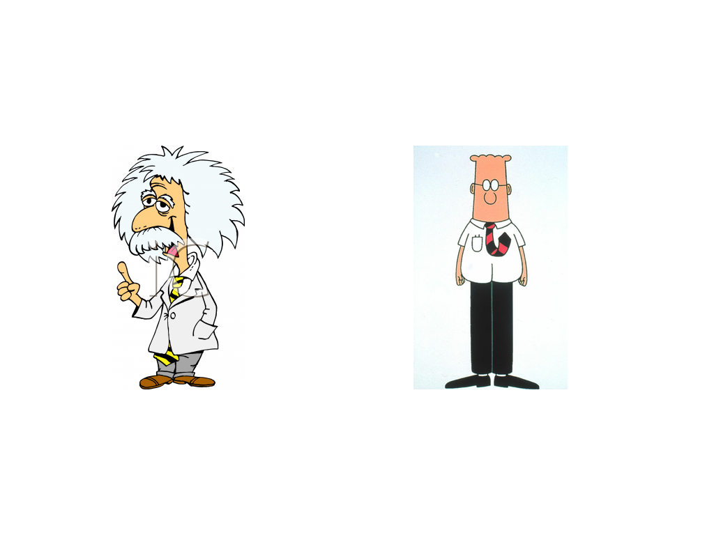
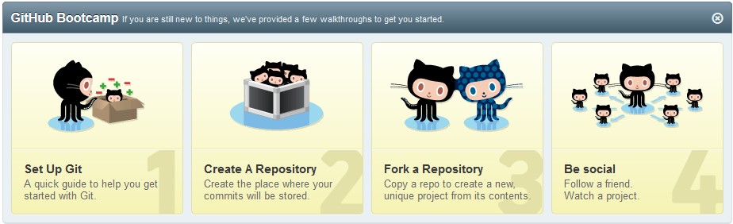
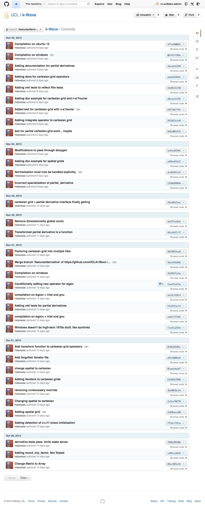
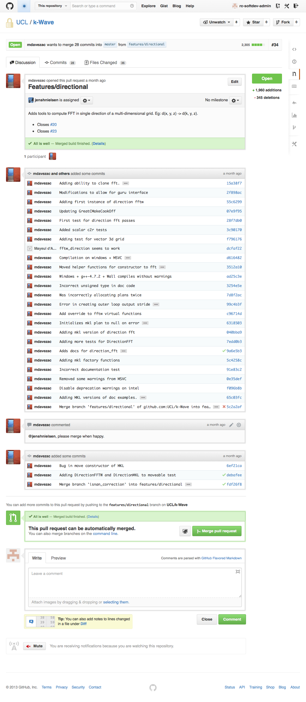
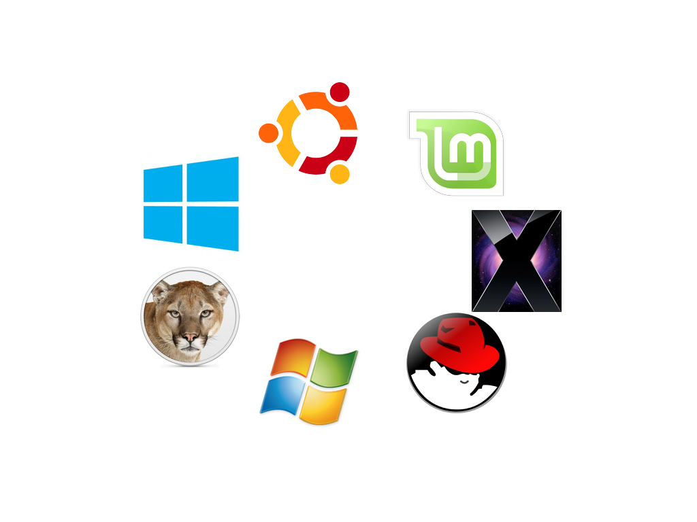

The State of Research Software
================================

The SIRO Problem
----------------

~~Garbage in Garbage Out~~

Sensible In, Reasonable Out.

PhDWare
-------

* Don't look if anyone's done it before
* Code till it works
* Generate a figure
* Throw it away

Labware
-------

* Understood by one genius
* Implements great science, now
* FORTRAN in any language
* Code not engineered for readability
* Can't add new science

HPCWare
-------

* Get a 5% improvement in performance
* On a particular architecture
* Publish a scaling graph
* Selection against:
      * Readability
      * Maintainability
      * Adaptability

ConsultantWare
--------

* Little understanding of the science
* Overengineered
* Unmaintainable by the research group

Research Software Developers
============================

The Craftsperson And The Scholar
----------------------------

Research Software Developers
----------------------------

Research Software Developers
----------------------------

* Not researchers
    * No personal research agenda
* Facilitative, supportive, and collaborative
    * Deep engagement with research groups
    * Understand, study, and be part of group research activities
    * Can read and understand the papers
* Sustainable and long term
    * Institutional memory
    * Continuity, stability, maintainance

Who we are
----------

UCL Research Software Development
=================================

Activities
----------

* Projects
* Consulting
* Training
* Infrastructure

Domain
------

* From HPC codes to simple scripts
* From theoretical physics to digital humanities

UCL Staffing
------------

* 5 Team Members including leader
* Three centrally funded
* Two research grant funded

Call for projects
-----------------------------

* Judged by executive
* Every quarter
* Half FTE for term
* Worth £8k
* Eight projects so far

Paid Projects
=============

Paid Projects
-------------

* Via research grants
* Or existing college money
* Displaces free calls
    * Until recruit
* Submitted £0.5M
* Secured £130k

Some sample projects
====================

Low-Template DNA
================

Whodunnit code: low-template DNA
--------------------------------

Whodunnit code: low-template DNA
-----------------------

* Low-template DNA
* Relative likelihood of defence and prosecution hypotheses
* Optimise over relative degree of contribution from various individuals

Structural work on likeLTD
--------------------------------------------

* Broken down into functions
* Separate objective function from simulated annealing optimiser
* Look at using different optimiser libraries
* Documentation added
* Ready for publication to CRAN

Performance Improvements in likeLTD
-------------------------------------------

* 4 times from moving to C
* 8 times from parallelisation
* 10 times from change of optimisation algorithm
* 300 times total

Performance Improvements in likeLTD
-----------------------------------

DCProgs
=======

DCProgs
-------

Old State of the Code
-----------------

* Hasn't compiled since 2006
* Underpins Nature-published research
* Reimplemented in C++ and Python
* Use linear algebra and root finding libraries

New State
---------

* Reimplemented in Modern C++ and Python
* Just as performant as the Fortran

HemeLB Setup Tool
=================

HemeLB Setup Tool
-----------------

Voxelisation
------------

Robustness
----------

Robustness
----------

* ~95% to 100%.
* Voxelisation in the loop

Priorities
==========

Priorities
----------

* Readability
* Reliability
* Deployability
* Sustainability
* Replicability
* Usability
* Performance

**In that Order**

Code Management Infrastructure
==============================

Github
------

Issue Tracking
------------------------------

Code Differences
------------------------------

Comment on Code
------------------------------

Bug Discussion
------------------------------

Pull Requests
------------------------------

Social Coding
------------------------------

Testing
=======

You don't need to test if:
--------------------------

> * Your programs always work correctly, or
> * You don't care if they're correct or not, so long
    as their output looks plausible, and
> * You like being inefficient:
    the more you invest in quality, the less total time
    it takes to build working software

Jenkins
---------------------------------

Cross-platform Testing
---------------------------------

Training
========

Training
--------

> "Many of the students
being trained through the Centres will be using computational techniques in their
projects, and some may have projects aimed specifically at software
development. It is essential that they are given appropriate training
so that they
can confidently use, extend and develop software in a way that supports correct,
reproducible and reusable research."

-- EPSRC Centres for Doctoral Training Call

Software Carpentry
------------------

Software Carpentry
------------------

* Intensive "bootcamp"
* Automation
* Version control
* Unit testing
* Databases

> ``I found the command line intimidating at first, but after a while it felt
> like I was inside my computer.''

-- A student at the UCL software carpentry event

Other Training Courses
----------------------

* C++ For Research
* Python for research (in development)
* Research software Engineering

Coda
====

Acknowledgements
----------------

* Clare Gryce, Gavin McLachlan, Mike Cope, Rex Knight
* Anthony Finkelstein, Richard Catlow, David Price, John Shawe-Taylor, Simon Arridge, Peter Coveney
* Timo Betcke, Michail Stamatakis, David Balding, Miguel Bernabeu, Remis Lape, David Colquhoun
* Mayeul D'Avezac, Jens Nielsen, Bruno Silva, Owain Kenway, Ian Kirker, Brian Alston
* Dirk Gorissen, Simon Baxter, Ilian Todorov
* Neil Chue Hong, Kenji Takeda, David de Roure
* Andrew Smith, Ben Waugh, Greg Wilson
* Greg Wilson

Contact
-------

 \@uclrcsoftdev \@jamespjh

 blogs.ucl.ac.uk/research-software-development

 j.hetherington@ucl.ac.uk

Why you should have one
-----------------------

* More and more research uses software
* General programmers can't understand research
* Postdocs and PhD students don't make reliable code

Why you should be one
---------------------

* Understand research
* Make code
