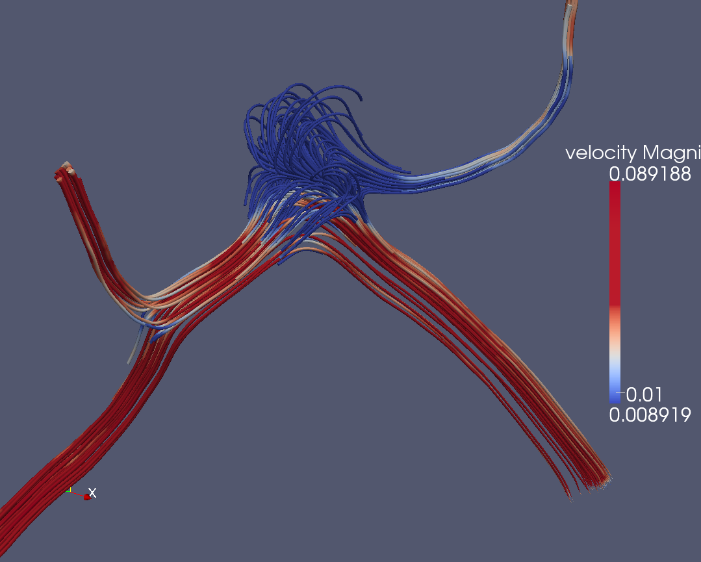

James Hetherington
------------------

* PhD, Theoretical Physics
    * High-Energy Physics, Cavendish Laboratory
* Post-doc, systems biology, UCL CoMPLEx
    * Glucose homeostasis
* The MathWorks
    * Senior Developer, Model Management Group
* Senior Scientific Innovator, AMEE UK Ltd
    * Environmental impact modeling
* Scientific Programmer, UCL CCS
    * Brain blood flow CFD
* Leader and Founder, UCL Research Software Development

The State of Research Software
================================

The SIRO Problem
----------------

~~Garbage in Garbage Out~~

Sensible In, Reasonable Out.

PhDWare
-------

* Don't look if anyone's done it before
* Code till it works
* Generate a figure
* Throw it away

Labware
-------

* Understood by one genius
* Implements great science, now
* FORTRAN in any language
* Code not engineered for readability
* Can't add new science

HPCWare
-------

* Get a 5% improvement in performance
* On a particular architecture
* Publish a scaling graph
* Selection against:
      * Readability
      * Maintainability
      * Adaptability

ConsultantWare
--------

* Little understanding of the science
* Overengineered
* Unmaintainable by the research group

Research Software Developers
============================

The Craftsperson And The Scholar
----------------------------
           


Research Software Engineers
----------------------------


Research Software Engineers
----------------------------

* Not (primarily) researchers
    * No personal research agenda
* Facilitative, supportive, and collaborative
    * Deep engagement with research groups
    * Understand, study, and be part of group research activities
    * Can read and understand the papers
* Sustainable and long term
    * Institutional memory
    * Continuity, stability, maintainance

Why it works
------------

* People *want* to be RSEs
* We have been hiding as:
    * RAs who program too much
    * HPC or research group sysadmins
* We need a name, and some status
* The research system needs to
    * Measure and incentivise RSEs correctly
    * Integrate RSEs within HEIs
    * Support institutional innovation

UCL Research Software Development
=================================

Governance
----------


Governance
----------

   

Activities
----------

* Projects
* Consulting
* Training
* Infrastructure

Domain
------

* From HPC codes to simple scripts
* From theoretical physics to digital humanities

UCL Staffing
------------

* 3 Permanent Roles (Central IT funding)
* Three grant-funded Research Software Developers

Call for projects
-----------------

* Judged by academic panel
* Every quarter
* Half FTE for term 
* Worth £8k
* Ten projects so far

Paid Projects
=============

Paid Projects
-------------

* Via research grants
* Or existing college money
* Displaces free calls
    * Until recruit
* Secured £400k (Roughly 33% success rate)
* Total income to UCL ~£1.5M

Sample free projects
====================

Low-Template DNA
================

Whodunnit code: low-template DNA
--------------------------------

 

Whodunnit code: low-template DNA
-----------------------

* Low-template DNA
* Relative likelihood of defence and prosecution hypotheses
* Optimise over relative degree of contribution from various individuals

Structural work on likeLTD
--------------------------------------------

* Broken down into functions
* Separate objective function from simulated annealing optimiser
* Look at using different optimiser libraries
* Documentation added
* Ready for publication to CRAN

Performance Improvements in likeLTD
-------------------------------------------
  
* 4 times from moving to C
* 8 times from parallelisation
* 10 times from change of optimisation algorithm
* 300 times total

Performance Improvements in likeLTD
-----------------------------------


DCProgs
=======

Old State of the Code
-----------------

* Very old-style Fortran
* Hasn't compiled since 2006
* Underpins Nature-published research

New State
---------

* Reimplemented in C++ and Python
* Use linear algebra and root finding libraries
* Just as performant as the Fortran

HemeLB Setup Tool
=================

HemeLB Setup Tool
-----------------



Voxelisation
------------


Robustness
----------


Robustness
----------

* From ~95% to 100%.
* Voxelisation in the loop

Priorities
==========

Priorities
----------

* Readability
* Reliability
* Performance

**In that Order**

Priorities
----------

* Readability
* Reliability
* Deployability
* Sustainability
* Replicability
* Usability
* Performance

Sources of Software Culture
===========================

Sources of Software Culture
---------------------------

* Enterprise software
* Web software
* Research Software

Agile Processes
---------------

* Short work cycles
* Controlled meetings
* Iterative development
* Customers inside the team
* Collaboration not contract

Continuous Delivery
-------------------

* Release early
* Release often
* Use DevOps for automated deployment

Test Driven Development
-----------------------

* Test everything
* Test first
* Test all the time
* Use tests as specs

Infrastructure
--------------

* Version Control
* Issue Tracking
* Code Review
* Code sharing
* Continuous Integration
* DevOps

Code Management Infrastructure
==============================

Github
------


Issue Tracking
--------------


Pull Requests
-------------


Social Coding
-------------


Testing
=======

You don't need to test if:
--------------------------

> * Your programs always work correctly, or
> * You don't care if they're correct or not, so long
    as their output looks plausible, and
> * You like being inefficient: 
    the more you invest in quality, the less total time
    it takes to build working software


Tests As Specifications
-----------------------

Testing tells you:

> * If the program is doing what it's supposed to
> * What the program actually is supposed to do
> * Tests are runnable specifications:
> * Less likely to fall out of sync with the program
    than documentation

Levels of Testing
-----------------

> * Regression testing: Does my code work the same as yesterday
> * Functional testing: Does my code match an analytic solution
> * Unit testing: Does this subroutine work as expected

Continuous Testing Infrastructure
---------------------------------


Jenkins
-------


Cross-platform Testing
----------------------


Example Paid Projects
=====================

ORACC
-----


Purify
------


Zacros
------


* Started as free project
* Continued using local funds
* Won ARCHER eCSE
* First commercial sale January 2015

Automation
==========

How Things Should Be
--------------------

``` Bash
fetch_dataset 53b6
run_model dataset_53b6
examine_results results_28_02_13_1_53b6_98d2
archive_results latest
create_graphs results_28_02_13_1_53b6_98d2
```

Program or Be Programmed
------------------------

* Repetition Leads to Boredom
* Boredom Leads To Horrifying Mistakes
* Horrifying Mistakes Leads to God-I-Wish-I-Was-Still-Bored

-- Will Larson

Automation is Reproducibility
-----------------------------

* Computational research can be *more* reproducible than other methodologies
* Currently it is less; how often do we replicate computational experiments?
* Automated research is Auditable Research

This talk's Dexyfile
--------------------

``` yaml

".md|jinja|pandoc|-reveal|resub|h":
    - inputs
    - except: [index, slidelink]
    - output-name: "{baserootname}-reveal.html"
    - pandoc:
        args: -t revealjs -V theme=night
            --css=http://lab.hakim.se/reveal-js/css/theme/night.css
            --css=/css/ucl_reveal.css
            --css=/css/slidetheme.css
            --default-image-extension=png
            --highlight-style=zenburn
            --mathjax
            -V revealjs-url=http://lab.hakim.se/reveal-js

assets:
    - .css
    - .png
    - .js

sequence_charts:
    - .wsd|wsd:
        - wsd:
            style: napkin

uml:
    - .yuml|yuml

graphs:
    - .dot|dot:
        - assets
```

This Talk On Jenkins
--------------------

``` yaml
jobs:
  - 'talks-publisher':
     repo: UCL/rsd-talks
     directory: output-site
     exec:
        dexy setup
        python deploy.py
        dexy
```

Publishing from Jenkins with Puppet
-----------------------------------

``` puppet
define jenkins_config::web_publish (
  $job="${title}-publisher",
  $from="output",
  $to=$title,
  ) {

  file {"${name}_${job}_${from}":
    path => "/etc/httpd/conf.d/${name}.conf",
    content => template('jenkins_config/web_publish.erb'),
      owner   => 'apache',
      notify  => Service['httpd']
  }
}
```

Training
========

Training
--------

> "Many of the students
being trained through the Centres will be using computational techniques in their
projects, and some may have projects aimed specifically at software
development. It is essential that they are given appropriate training
so that they
can confidently use, extend and develop software in a way that supports correct,
reproducible and reusable research."

-- EPSRC Centres for Doctoral Training Call

Software Carpentry
------------------


Software Carpentry
------------------

* Intensive "bootcamp"
* Automation
* Version control
* Unit testing
* Databases

> I found the command line intimidating at first, but after a while it felt
> like I was inside my computer.

-- A student at a UCL software carpentry event

A syllabus for research computing
---------------------------------

* [Research Software Engineering With Python](http://development.rc.ucl.ac.uk/training/engineering)
* [Research Computing with C++](http://development.rc.ucl.ac.uk/training/rcwithcpp)

Coda
====

Acknowledgements
----------------

* Clare Gryce, Gavin McLachlan, Mike Cope, Rex Knight
* Anthony Finkelstein, Richard Catlow, David Price, John Shawe-Taylor, Simon Arridge, Peter Coveney
* Timo Betcke, Michail Stamatakis, David Balding, Miguel Bernabeu, Remis Lape, David Colquhoun
* Eleanor Robson, Jason McEwen, David Holder, Sebastien Ourselin
* Mayeul D'Avezac, Jens Nielsen, Bruno Silva, Owain Kenway, Ian Kirker, Brian Alston
* Dirk Gorissen, Simon Baxter, Ilian Todorov, Rob Haines
* Neil Chue Hong, Simon Hettrick, Kenji Takeda, David de Roure
* Ana Nelson, Kohsuke Kawaguchi
* Andrew Smith, Ben Waugh, Matt Clarkson
* Greg Wilson

Contact
-------
 
 \@uclrcsoftdev \@jamespjh

 blogs.ucl.ac.uk/research-software-development

 j.hetherington@ucl.ac.uk

Why you should have one
-----------------------

* More and more research uses software
* General programmers can't understand research
* Postdocs and PhD students don't make reliable code

Why you should be one
---------------------

* Understand research
* Make code

Why you should be one
---------------------


