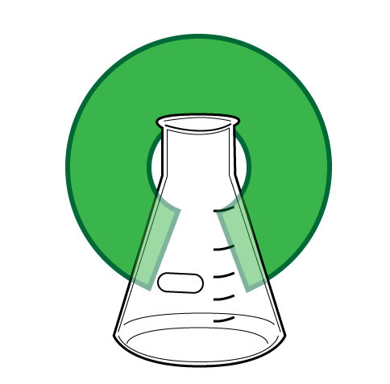
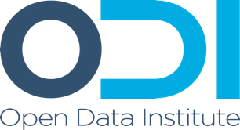
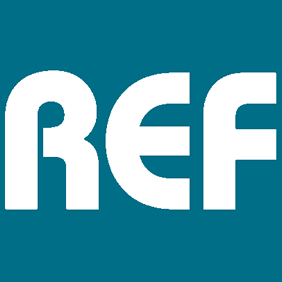
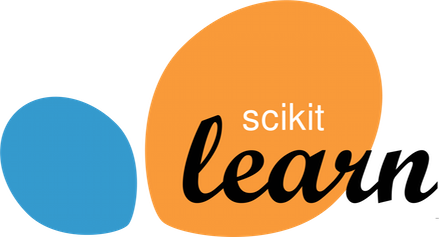

# Who needs eResearch Skills?

## Program or be Programmed

* "Data Scientist" - "Food Chef?"
* *Reproducible* data-driven research *is* programming.
    * Come for the labour savings, but stay for the audit trail

## Modelling and Inference

* Convergence between the third and fourth paradigms:
    * We need big-data methods to understand the outputs of models
    * Inferential methods require high performance techniques to model the data
* Statistical, algorithmic, computational literacies relevant across the board

## The syllabus is full.

* Ideally, *everyone* would know *everything*!
* This is clearly impossible
* So we need *division of labour*.

## The three Roles

* Methods and algorithms researchers
* Data-literate domain researchers
* Translational e-Research collaborators
    * Research Software Engineers
    * Data Scientists

## Careers must be fluid

* Evolving interests, revolving doors
* Seniority and status in each

# Who needs to know what?

# What do Data-literate domain researchers need to know?

## Data-literate domain researchers need to know:

* Their research domain!

## Reproducible research methods

* Scripting and data programming
* Automated testing
* Workflow building and "glueware"

## Reproducible research methods

## Computational collaboration methods

* Collaborative authoring
* Version control
* Code review

## Computational collaboration methods

## Open science literacies

* Working with linked open data
* Data and software publication
* Licensing and copyleft

## Open science literacies

## Data wrangling and presentation

* Data cleaning
* Databases
* Visual display of quantitative information
* Applied statistical inference

## Data wrangling and presentation

# What do methods and algorithms researchers need to know?

## Methods and algorithms researchers need to know:

* Their mathematical domain!

## The same things domain scientists do

## High performance computing and optimisation

* Schedulers, both traditional (qsub) and "cloudy" (hadoop etc)
* Parallel programming (MPI, OpenMP, CUDA, Map/Reduce...)
* Storage and IO performance

## High performance computing and optimisation

## Expressive mathematical programming

* Functional programming
* Domain specific languages
* Code generation and templating

## Expressive mathematical programming

# What do translational collaborators need to know?

## Enough mathematics and science to be relevant

* Read a paper, see the code
* Mathematical literacies
    * algorithms, statistics, calculus, geometry...
* Deep research background in something to understand the culture of research
* Fundamental core understanding across the domains they work with

## The same things as domain scientists

## The same things as algorithms researchers

## Deployability

## Continuous Integration

## Documentation

## Software Project Management

## Working effectively with legacy code

## Business models for open science

## Community building and engagement (citation generator)

## The application of the algorithmic toolbox

&nbsp;

## Selection and optimisation of available compute and data platforms

# How do we teach this?

## Intensive introductions

* Researchers are clever!
    * Rumsfeld's law: unknown unknowns
    * Drawing people's attention to new ways of working is critical
    * Software Carpentry and Data Carpentry

## Digitally native learning tools

* Web-first but classroom- and kindle-ready
    * Single source, multiple formats
* Examples which *work*:
    * Generated lecture notes from code that is *executed* and *complete*
* Open and collaborative
    * CC-BY license on notes
    * Massive cross-institutional co-creation

## Active classrooms

* Practicals and concepts together
* Bring your own device
* Post-it-notes and etherpads

# Who can teach this?

## Research Software Engineers and Data Scientists as Teachers

* The collaborator role is perfectly placed to teach these skills
    * Broad perspective
    * Continuing practical experience
    * Generates opportunities for collaboration

## RITS's training programme

* Software carpentry
* Data carpentry
* Introductory Python for Data Analysis
* Research Software Engineering with Python
* Research Computing with C++
* High Performance and High Throughput Computing

* See the [materials](https://www.ucl.ac.uk/isd/services/research-it/training)
