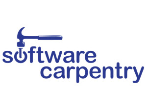

# Who needs eResearch Skills?

## Program or be Programmed

* "Data Scientist" - "Food Chef?"
* *Reproducible* data-driven research *is* programming.
  * Come for the labour savings, but stay for the audit trail

## Modelling and Inference

* We need big-data methods to understand the outputs of models
* Inferential methods require high performance techniques to model the data
* Convergence between the third and fourth paradigms
* Statistical, algorithmic, computational literacies relevant across the board

## The syllabus is full.

* Ideally, *everyone* would know *everything*!
* This is clearly impossible
* So we need *division of labour*.

## The three Roles

* Computational and Data Analysis methods researchers
* Data-literate domain researchers
* Translational e-Research collaborators
  * Research Software Engineers
  * Data Scientists

## Careers must be fluid

* Evolving interests, revolving doors
* Seniority and status in each

# Who needs to know what?

# What do Data-literate domain researchers need to know?

## Data-literate domain researchers need to know:

* Their research domain!

## Data-literate domain researchers need to know:

* Reproducible research methods:
    * Scripting and data programming
    * Automated testing
    * Workflow building and "glueware"
* Computational collaboration methods
    * Collaborative authoring
    * Version control
    * Code review

## Data-literate domain researchers need to know:

* Open science literacies
    * Working with linked open data
    * Data and software publication
    * Licensing and copyleft
* Data wrangling
    * Data cleaning
    * Databases
    * Visual display of quantitative information
    * Applied statistical inference

## Data-literate domain researchers need to know:

# What do methods and algorithms researchers need to know?

## Methods and algorithms researchers need to know:

* Reproducible research methods
* Computational collaboration methods
* Open science literacies
* Expressive mathematical programming: Don't Repeat Yourself
    * Functional programming
    * Domain specific languages
* High performance computing
    * Schedulers, both traditional (qsub) and "cloudy" (hadoop etc)
    * Parallel programming (MPI, OpenMP, CUDA, Map/Reduce...)
    * Storage and IO performance

## Methods and algorithms researchers need to know:

* Their mathematical domain!

# What do translational collaborators need to know?

## Translational collaborators need to know:

* Expressive mathematical programming
* High performance computing
* Open science literacies
* Reproducible research methods
* Data wrangling
* High performance computing

## Translational collaborators need to know:

* Software engineering
   * Design and architecture
   * Deployability
   * Continuous integration
   * Usability and HCI
   * Security
   * Documentation
   * Working effectively with legacy code

## Avenues for software impact

* Business models for open science
* Community building and engagement (citation generator)

## Translational collaborators need to know:

* The application of the algorithmic toolbox
   * The index of the software library toolbox
   * Performance tuning and parameter wrangling
   * Selection and optimisation of available compute and data platforms

## Translational collaborators need to know:

* Enough mathematics to understand what they are coding!
  * Read a paper, see the code.
  * Mathematical literacies.
    * algorithms, statistics, calculus, geometry...
* Enough science to understand who they are coding for:
  * Deep research background in something to understand the culture of research
  * Fundamental core understanding across the domains they work with

# How do we teach this?

## Intensive introductions

* Researchers are clever!
  * Rumsfeld's law: unknown unknowns
  * Drawing people's attention to new ways of working is critical
  * Software Carpentry and Data Carpentry

## Digitally native learning tools

* Web-first but classroom- and kindle-ready
  * Single source, multiple formats
* Examples which *work*:
  * Generated lecture notes from code that is *executed* and *complete*
* Open and collaborative
  * CC-BY license on notes
  * Massive cross-institutional co-creation

## Active classrooms

* Practicals and concepts together
* Bring your own device
* Post-it-notes and etherpads

# Who can teach this?

## Research Software Engineers and Data Scientists as Teachers

* The collaborator role is perfectly placed to teach these skills
  * Broad perspective
  * Continuing practical experience
  * Generates opportunities for collaboration

## RITS's training programme

* Software carpentry
* Data carpentry
* Introductory Python for Data Analysis
* Research Software Engineering with Python
* Research Computing with C++
* High Performance and High Throughput Computing

* See the [materials](https://www.ucl.ac.uk/isd/services/research-it/training)
