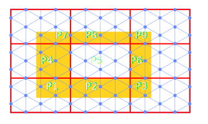

Introduction to Zacros
======================

Zacros:
-------

* Kinetic Monte Carlo (KMC) simulation of surface chemistry
* Graph theoretical formulation
    - Reaction given as graphs
    - identified as sub graphs of the lattice
* Possible Reactions get a time assigned based on:
    - kinetic rate constants (Propensities)
    - A random number

See Stamatakis and Vlachos. 2011. J. Chem. Phys. 134(21): 214115
and
Nielsen et. al. 2013. J. Chem. Phys. 139(22): 224706

Surface energy
--------------

To calculate rates, the surface energy is needed:

* Surface energy is given as a cluster expansion
* I.e. an expansion in simple surface patterns 

Pseudo code
-----------

* Select reaction with the lowest time
* Remove adsorbates from lattice
* Remove clusters and reactions involving the reactants
* Add product adsorbates
* Find new energy clusters
* Find existing processes that need update
* Update rates of existing processes
* Add new processes.

Cluster Expansion
-----------------

* Long range interactions requires large cluster expansions.
* Larger cluster expansions =>  More processes to update
* This is the first performance issue

Lattice size
------------

Large lattice for accurate simulations

* Update time is independent of lattice size
* But reaction rate is not
* KMC time / CPU time depends linearly on the number of sites
* Large lattices are time consuming to simulate
* The second performance issue

Speed-up Updates:
=========================

OpenMP:
-------

* Profiling shows bottleneck in update rates ...
* Many processes are affected
    - Especially for large cluster expansion
* Do loop of independent processes to update
* OpenMP parallization of this loop

See Nielsen et. al. 2013. J. Chem. Phys. 139(22): 224706

Scaled performance of OpenMP
----------------------------

Computational time per event
----------------------------

Computational time / KMC time
---------------------------------

* But number of events per simulated second is not
* 12 figure expansion at 7056 lattice points (12 threads):
    - $> 10^4$ seconds per simulated second

Limitations
-----------

Decent speed up for large cluster expansions but:

* OpenMP limited to one computational node
* Simulations are still too slow for large lattices and clusters

Solution: MPI Parallelization over lattice

Spatial Parallelization
=======================

MPI based parallelization
-------------------------

* Reactions on individual domains
* Halo for
    - Reactants
    - Products
    - Energetic clusters

Original plan:
--------------

To implement algorithm proposed by Lubachevsky

* Algorithm is developed for Ising spin model
* Each domain keeps track of a local time
* Global time is min(localTimes)
* Updates in a MPI domain is allowed if:
    - Local time is smaller than all neighbours

Lubachevsky. 1988. J. Comp. Phys. 75 (1): 103

Algorithm
---------

* Perform reaction if time is smallest among neighbours
* Select a site and either:
    - Perform spin flip
    - Perform null event
* Advance local time by a random interval
* Repeat

Time advancement is independent of whether a spin is flipped

Energetics affect the relative probability of null events

Algorithm in Zacros
-------------------

Same principle:

* If local time < neighbours time:
    - Advance local time
    - Perform reaction
    - Send halo and new local time
* Else:
    - Wait to receive halo and time

Issues in Zacros
----------------

* Future reactions have a wait time associated with them
* Wait time is random but determined by reaction rates
* Most imminent reaction is performed
* Reaction happen after wait time
* Wait time can differ by several orders of magnitude

Example
-------
Assume that we have 3 MPI nodes in a 1D array

Both $P_1$ and $P_3$ are free to perform reactions

Example
-------
Assume that we have 3 MPI nodes in a 1D array

Conflict $\textrm{P}_1$  should not have performed a reaction

In Zacros
---------

* Can't change the condition to smallest among $T_{local} + T_{wait}$
    - The reactions that $T_{wait}$ on neighbours represent have not happened:
    - In fact they may never happen
    - Reactions may propagate across domains

Alternative strategies
----------------------

An alternative proposed by Jefferson

* Each node propagates its reactions without synchronization
* Stores a list of anti reactions to performed reactions
* When a reaction is performed messages are sent to relevant neighbours

Jefferson. 1985. ACM Trans. Program. Lang. Syst. 7 (3): 404

Alternative strategies
----------------------

* If conflicts arise neighbours will roll-back 
    - Sending anti messages to their neighbours
    - With further potential roll-back
* The "slowest" node determine a virtual time horizon (Global time)
    - No roll-back beyond this is needed 

Bibliography
============

Bibliography
------------

Publications